<p align="center">
    
  <h1 align="center">Azure Machine Learning Engineer | Capstone Project</h1>
    <p align="center">
    project_description
    <br/>
</p>


A company is sponsorizing some courses for data scientist and wanto to hire potential candidates. Many people signup for their training. Company wants to know which of these candidates are really wants to work for the company after training. Using information related to demographics, education, experience are in hands from candidates signup and enrollment we want to predict their propensity to a job change.


## Project Overview
We want to provide a machine learning solution to itentify those candidates willing to change their job and to do so, we want to provide a REST endopint serving a model which answer the question.

To train and deploy such model we follow the diagram



Using the data gathered from Kaggle we registered them a dataset in an azureml workspace. Then we raun the **setup** pipeline which produces the training and the test dataset. 

On the train dataset we lanch both an *AutoMl* and an *Hyperdrive* Model to find the best possible model wrt the ROC-AUC classification metric.

The best model is then served as an endpoint to allow inference operations.
## Project Set Up and Installation
From the raw data available [here](https://www.kaggle.com/arashnic/hr-analytics-job-change-of-data-scientists) i've set up a pipeline that prepare the data for either the hyper-parameters search and for automl task.
It also take care of train and test splitting.

Details are available in the notebook `code/create_dataset.ipynb`


## Dataset
The original dataset contains:
- enrollee_id : Unique ID for candidate
- city: City code
- city_ development _index : Developement index of the city (scaled)
- gender: Gender of candidate
- relevent_experience: Relevant experience of candidate
- enrolled_university: Type of University course enrolled if any
- education_level: Education level of candidate
- major_discipline :Education major discipline of candidate
- experience: Candidate total experience in years
- company_size: No of employees in current employer's company
- company_type : Type of current employer
- lastnewjob: Difference in years between previous job and current job
- training_hours: training hours completed
- target: 0 – Not looking for job change, 1 – Looking for a job change


Note:

- The dataset is imbalanced.
- Most features are categorical (Nominal, Ordinal, Binary), some with high - cardinality.
- Missing imputation can be a part of your pipeline as well.
 about the data you are using and where you got it from.

### Task
We have to predict which data scientist is looking for a job change and thus, is a better prospect in terms of hiring.

### Access
#### Get the data into your Azure ML Studio

Before running the SetUp Pipeline we need to get the original dataset inside the Azure ML workspace.

To do that i've create a script available in `scripts\download_dataset.sh` which downloads the file inside the data folder and then we can use the python script `scripts\create_dataset.py` to register it as an Azure Ml Dataset.
#### PreProcessing and setup

By running the SetUp Pipeline, from the original dataset we register two different datasets

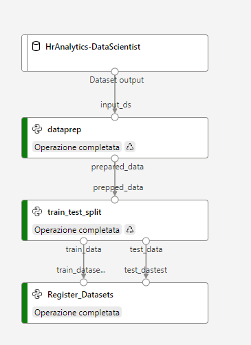

- `HRAnalytics_train_dataset`
- `HRAnalytics_test_dataset`


we can then access using the following python code: 

```{python}
# Dataset
dataset_name = "HRAnalytics_train_dataset"

dataset = ws.datasets[dataset_name]

df = dataset.to_pandas_dataframe()
df.head()
```


## Automated ML

In this first step, an AutoML run was lunched to search for a best possible model to handle the predictive task.

An `AutoMLConfig` is the the object we need to instantiate to configuring the experiment run:

```{python}

automl_settings = {
    "experiment_timeout_minutes": 20,
    "max_concurrent_iterations": 4,
    "n_cross_validations": 4,
    "primary_metric" : 'AUC_weighted'
}

automl_config = AutoMLConfig(compute_target=compute_cluster,
                             task="classification",
                             label_column_name="target",   
                             training_data =dataset,
                             enable_early_stopping=True,
                             featurization='auto',
                             debug_log="automl_errors.log",
                             **automl_settings
                            )
```

The parameters are:

- **experiment_timeout_minutes**: maximum amount of time in minutes that all iterations combined can take before the experiment terminates. It has been set to 20

- **max_concurrent_iterations**: maximum number of iterations that would be executed in parallel. It has been set to 4

- **n_cross_validations**: how many cross validations to perform when user validation data is not specified. It has been set to 4

- **primary_metric**: the metric that Automated Machine Learning will optimize for model selection. It has been set to AUC weighted between classes


### Results
After submitting the run to the Compute cluster we wait for it to complete by monitoring the widget: 

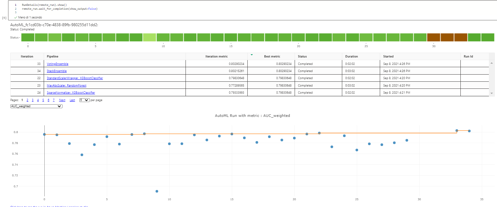

After it's done we can get the result of the AutoML job by gathering the:

* best run
* the best model
* the metrics associate to the best model
using the following code
```

best_run_automl, best_model_automl = remote_run.get_output()
best_run_metrics_automl = best_run_automl.get_metrics()

```

We fetched the model and tested it against the `test_dataset` we held for the purpose:

```
y_true = test_df["target"]
x = test_df.drop(columns=["target"])

y_pred= best_model_automl.predict(x)
```

The best model is a Voting Ensamble achieving a AUC weighted of 0.80, we can see the detail of the models here
```
PipelineWithYTransformations(Pipeline={'memory': None,
                                       'steps': [('datatransformer',
                                                  DataTransformer(enable_dnn=False, enable_feature_sweeping=True, feature_sweeping_config={}, feature_sweeping_timeout=86400, featurization_config=None, force_text_dnn=False, is_cross_validation=True, is_onnx_compatible=False, observer=None, task='classification', working_dir='/mn...
)), ('extratreesclassifier', ExtraTreesClassifier(bootstrap=False, ccp_alpha=0.0, class_weight='balanced', criterion='gini', max_depth=None, max_features=None, max_leaf_nodes=None, max_samples=None, min_impurity_decrease=0.0, min_impurity_split=None, min_samples_leaf=0.01, min_samples_split=0.056842105263157895, min_weight_fraction_leaf=0.0, n_estimators=200, n_jobs=1, oob_score=False, random_state=None, verbose=0, warm_start=False))], verbose=False))], flatten_transform=None, weights=[0.06666666666666667, 0.3333333333333333, 0.06666666666666667, 0.13333333333333333, 0.06666666666666667, 0.13333333333333333, 0.13333333333333333, 0.06666666666666667]))],
                                       'verbose': False},
                             y_transformer={},
                             y_transformer_name='LabelEncoder')
                             
```
and we can take a look at the run building it by looking at the studio: 
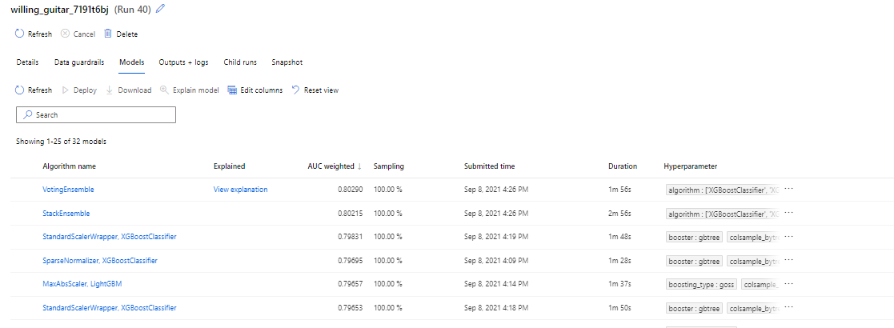

The detail of the best run are show here, describing the mertrics and the run details
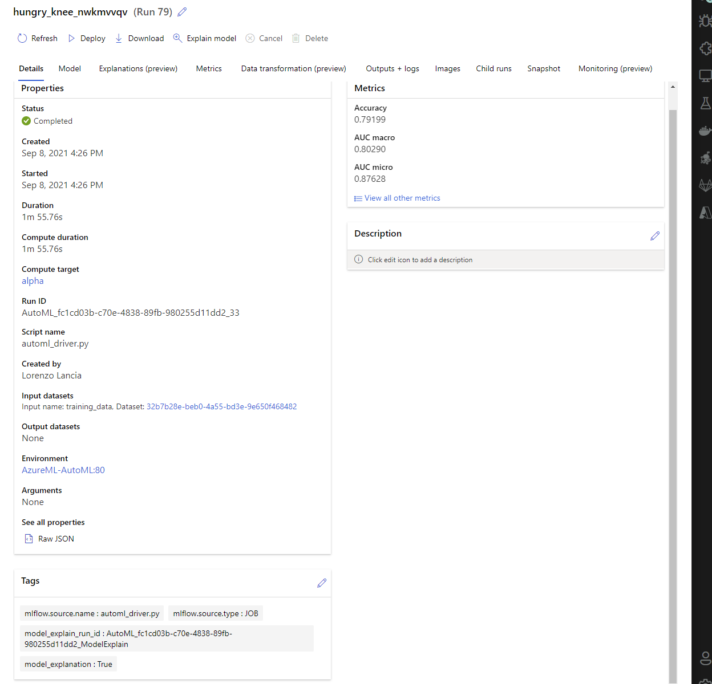

while the model is available from the Model tab

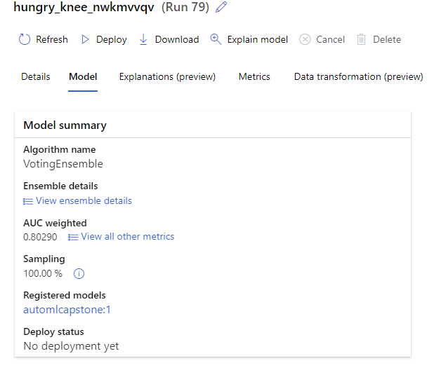

## Hyperparameter Tuning

In this task, an HyperDrive run  using a customized model is built. 

The model chosen is a RandomForest with its scikit-learn implementation.

RandomForest is a classification algorithm using a bagging of different trees. It has a very good resistance to overfitting and quite a lot of different hyperparameters to tune.

To ensure the different data are ready to be handeled by the classifier an sklearn pipeline is built around it as stated in the `train.py` script. 

**The script is available in** `code\steps_scripts\model\train.py` while the environment is available in `code\env` folder.

```
    numeric_features = ['city_development_index', 'training_hours']

    numeric_transformer = Pipeline(steps=[
        ('imputer', SimpleImputer(strategy='median')),
        ('scaler', StandardScaler())])

    categorical_features = ['city',  'gender', 'relevent_experience',
        'enrolled_university', 'education_level', 'major_discipline',
        'experience', 'company_size', 'company_type', 'last_new_job']

    categorical_transformer = Pipeline(steps=[
        ('caster', StringCaster()),
        ('encoder', OneHotEncoder(handle_unknown='ignore')),
        ]
    )


    preprocessor = ColumnTransformer(
        transformers=[ 
            ('num', numeric_transformer, numeric_features),
            ('cat', categorical_transformer, categorical_features)])


    clf = Pipeline(steps=[('preprocessor', preprocessor),
                        ('classifier', RandomForestClassifier(**classifier_params))])

```

The script can be lunched by passing different parameters representing some of  the hyperparameters of the model: 

```
    parser.add_argument('--n_estimators', type=int )
    parser.add_argument('--max_features', type=str)
    parser.add_argument('--max_depth', type=int)
```

* **n_estimator** is the number of the tree composing the ensamble
* **max_features** The number of features to consider when looking for the best split
* **max_depth** The maximum depth of the tree. I

We went through the combination of parameters to search the best one via a Random search which it does not give the absolute best parameters but its usually pretty close and helps in reducing the iteratons w.r.t a Grid Search approach.

To do this we defined a parameter space

```{python}
ps = RandomParameterSampling({
        "--n_estimators": choice( [int(x) for x in np.linspace(start = 200, stop = 2000, num = 10)]),
        "--max_features": choice('auto', 'sqrt'),
        "--max_depth": choice([int(x) for x in np.linspace(10, 110, num = 11)])
    }
)
```
and a early termination policy
```
policy = BanditPolicy(slack_factor = 0.1,
                        evaluation_interval = 1,
                        delay_evaluation = 5)
```

to finally submit a Hyperdrive run

```
hyperdrive_config = HyperDriveConfig(run_config=src,
                                     hyperparameter_sampling=ps,
                                     policy = policy,
                                     primary_metric_name="AUC",
                                     primary_metric_goal=PrimaryMetricGoal.MAXIMIZE,
                                     max_total_runs=20,
                                     max_concurrent_runs=4,
                                     )
```

and use the widget to monitor it and look at the evolution of the best metric as the job explore the parameters space.

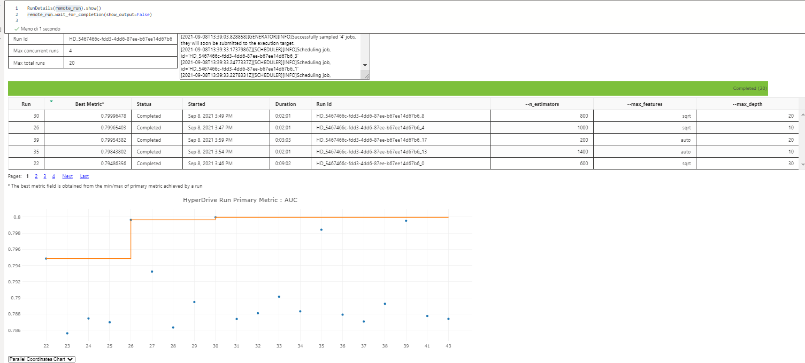
### Results
We collected the best run by AUC
```
best_run = remote_run.get_best_run_by_primary_metric()
```
and we take a look at the best run and its detail from the azureml studio interface.


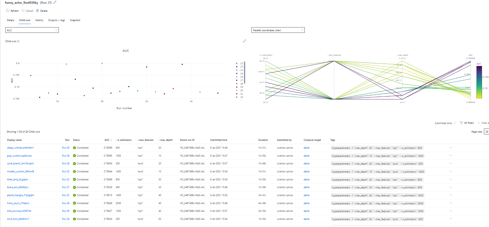

we can deep dive into the best run which show as the best set of hyper-parameters and the recieved accuracy.
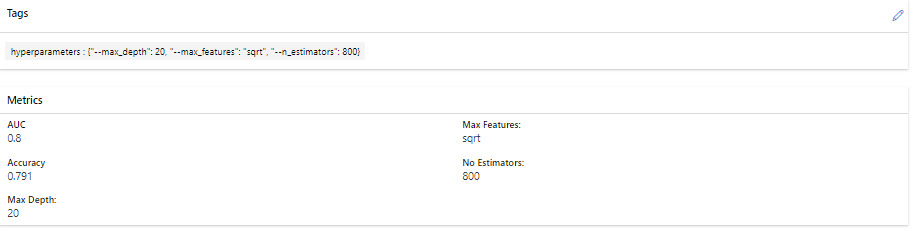

this run achieved a score of 0.8 with the set of hyperparameters: 


```
hyperparameters : {"--max_depth": 20,
 "--max_features": "sqrt",
  "--n_estimators": 800}
```

and registered the best model by:

```
registered_model = best_run.register_model(model_name = experiment_name+"model", model_path= saved_model)
```

this saves the model and allow us to use it in other jobs, including a deployment operation. The models can be explored from the model section of azure ml studio.

This are the details, note that it links back to the run producing it allowing us to reproduce the experiment in case of need. 
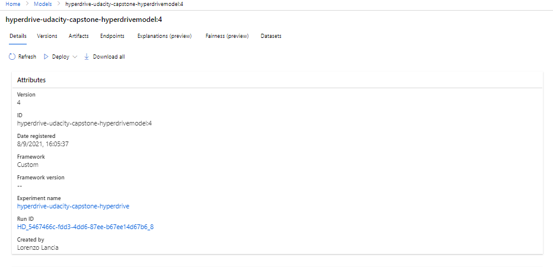
## Model Deployment

Performance of the two models obtained by automl and hyperdrive are pretty much comparable. 

I've decided to deploy the custom model obtained by hyperdrive to force myself to deploy a completely custom item. 

### Adapt environmet

First i need to add to the Python env used for training two dependencies used to handle the inference and the service.

```
conda.add_pip_package("azureml-model-management-sdk")
conda.add_pip_package("inference-schema")
env.python.conda_dependencies = conda
```

the final environment is available in `code\env`

then we create `AciWebservice` configurtion and we used it for deploy
```
from azureml.core.model import Model, InferenceConfig
from azureml.core.webservice import AciWebservice

inference_config = InferenceConfig(entry_script='score.py', environment=env, source_directory='./steps_scripts/model/' )


aci_deployment_config = AciWebservice.deploy_configuration(cpu_cores=1,
                                                           memory_gb=1,
                                                           auth_enabled=True,
                                                           enable_app_insights=True,
                                                           description='AutoML model deploy')
```

is important to refer to the `score.py` script which handles the calls to the rest endpoint.

Aside from deserializing the model and provide a `run(data)` function, i've added a set of sample input for him to infer the proper schema.


```

service_name = "test-deploy-ht"
service = Model.deploy(workspace=ws,
                       name=service_name,
                       models=[registered_model],
                       inference_config=inference_config,
                       deployment_config=aci_deployment_config,
                       overwrite=True
                      )
service.wait_for_deployment(show_output=True)


print('Deployment state: ', service.state)
print('Scoring URI: ', service.scoring_uri)
```

This is how the endpoint appears after the deploy, the status is healthy and it signals us that we can now call.
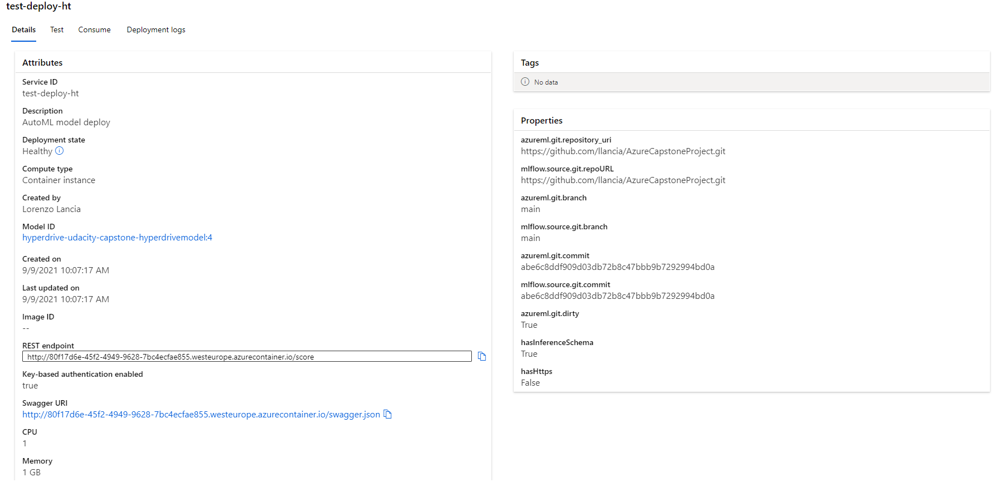

we wait for deployment till we can make request to the endpoint by using the code in `endpoint.py`

```{python}
import requests
import json
from numpy import nan 
# URL for the web service, should be similar to:
# 'http://8530a665-66f3-49c8-a953-b82a2d312917.eastus.azurecontainer.io/score'
scoring_uri = 'http://96f9e630-43b1-4876-820e-9b1d857c7bb2.westeurope.azurecontainer.io/score'
# If the service is authenticated, set the key or token
key = '4vxJev904dUJTZGIEpsexvGl55AUcBDC'
# A set of data to score, so we get one results back
data = {"data":
        [{'city': 'city_103',
  'city_development_index': 0.92,
  'gender': nan,
  'relevent_experience': 'Has relevent experience',
  'enrolled_university': 'no_enrollment',
  'education_level': 'Graduate',
  'major_discipline': 'STEM',
  'experience': '>20',
  'company_size': '10/49',
  'company_type': 'Pvt Ltd',
  'last_new_job': '>4',
  'training_hours': 140}]
}
# Convert to JSON string
input_data = json.dumps(data)
with open("data.json", "w") as _f:
    _f.write(input_data)
# Set the content type
headers = {'Content-Type': 'application/json'}
# If authentication is enabled, set the authorization header
headers['Authorization'] = f'Bearer {key}'
# Make the request and display the response
resp = requests.post(scoring_uri, input_data, headers=headers)
print(resp.json())
```

The service can handle also multiple inference with a single request

```
multiple_run = x.sample(78).to_dict(orient="records")
input_data = json.dumps({"data": multiple_run})
#print(input_data)
resp = requests.post(scoring_uri, input_data, headers=headers)
print(resp.json())
```
producing a list of results

```
{"result": ["no", "no", "no", "no", "yes", "yes", "no", "yes", "no", "no", "no", "no", "no", "no", "no", "yes", "no", "no", "yes", "no", "no", "no", "no", "no", "yes", "no", "yes", "no", "no", "no", "no", "no", "yes", "no", "no", "no", "no", "yes", "yes", "no", "yes", "no", "yes", "no", "no", "no", "no", "no", "no", "no", "no", "no", "yes", "yes", "no", "no", "no", "no", "no", "no", "yes", "no", "yes", "no", "no", "no", "no", "no", "no", "no", "no", "yes", "no", "no", "no", "no", "no", "no"]}

```

finally we printed the logs and deleted the service.

```
print(service.get_logs())
service.delete()
```

## Screen Recording
link to screen cast https://youtu.be/PnpwXfrYE0w
containing 
- A working model
- Demo of the deployed  model
- Demo of a sample request sent to the endpoint and its response

## Future improvements

* **Single pipeline from dataset to deploy** the pipeline used in the setup phase may be further extended to cover all the training steps, testing against held out test data and then deploy of the best model.

* **Model explaination with shap values** Is interesting to compute some explainition of the model (eg using shapely values). The contribution of each feature may be returned from the service during rest call.

* **Pipeline for batch inferencing** Scoring of the model against a new dataset should be done offline with a batch inferencing pipeline. 
